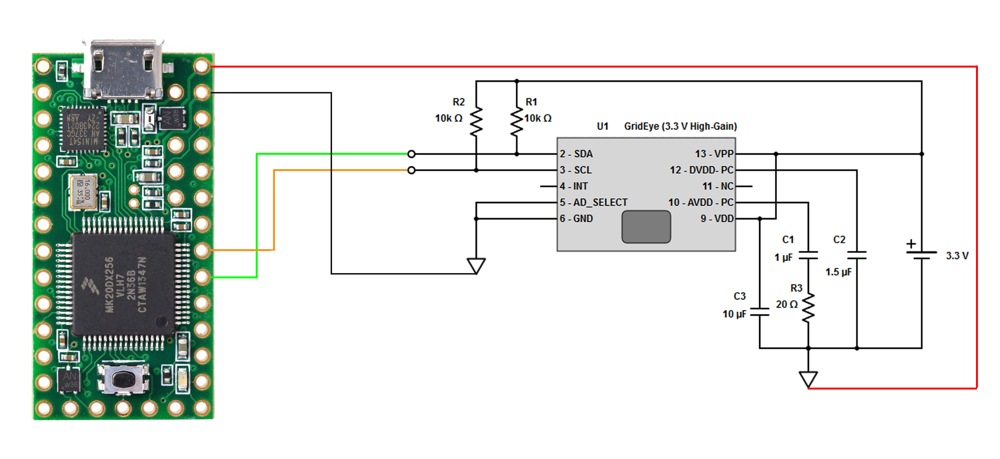

# Panasonic Grid-Eye on Teensy 3.2
This is a guide to use a grid-eye on teensy 3.2 with Arduino, and display data as a heat matrix through Processing.

## Installing

### Scheme

### Installing Arduino IDE & Teensyduino
1. Download the latest version of Arduino IDE [here](https://www.arduino.cc/).
2. Download the Teensyduino software [here](https://www.pjrc.com/teensy/td_download.html).
3. Load the [grid-eye.ino sketch](./grid-eye.ino) in Arduino.
4. Follow the scheme, and connect your Teensy to your computer.

Arduino IDE should recognize the teensy, to check it out, look under the **Menubar > Tools SECTION**.  

Now, you are able to show data through Arduino serial monitoring. It will probably requires some calibration, so feel free to adapt the code to your needs.  

### Installing Processing | Associating with Arduino
As the data is quite difficult to interpret on its own (64 values updating too quickly to understand what's happening), I decided to create a minimalist GUI with Processing.
The GUI intends to display the data as a heat matrix.

1. Download Processing v2.0 from the [official site] (https://processing.org/).
2. Connect Arduino IDE and Processing. Then, follow the steps described [here](http://playground.arduino.cc/Interfacing/Processing).
3. Load the [gui.pde sketch](./gui/gui.pde) in Processing.
4. You are all set ! Run the sketch and enjoy. 🎉

### About
This is a very old project !
Still, just let me know if you had any issues setting up the Grid-Eye with your Teensy.

[Sparky Raccoon, lord of pancakes](https://github.com/sparky-raccoon)
